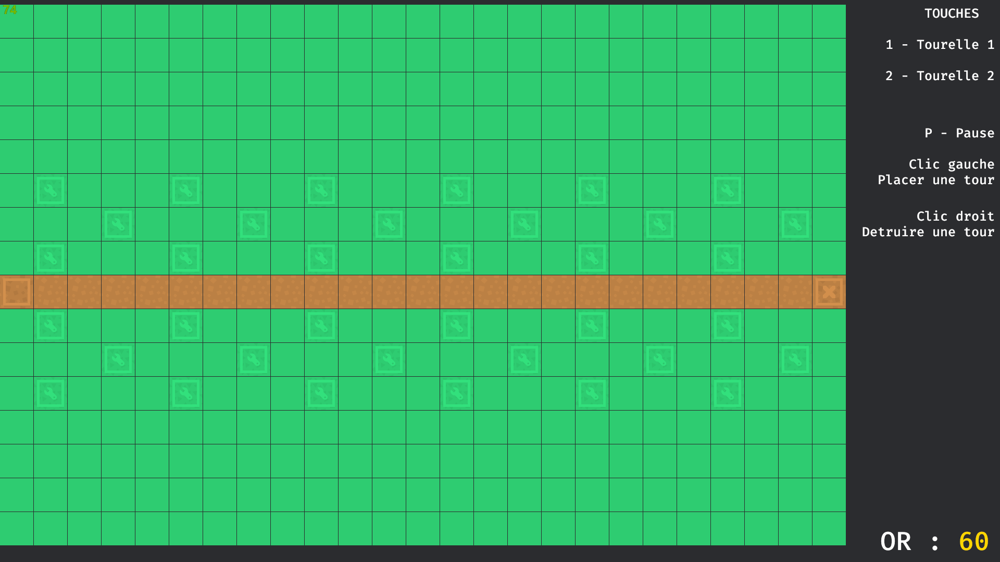
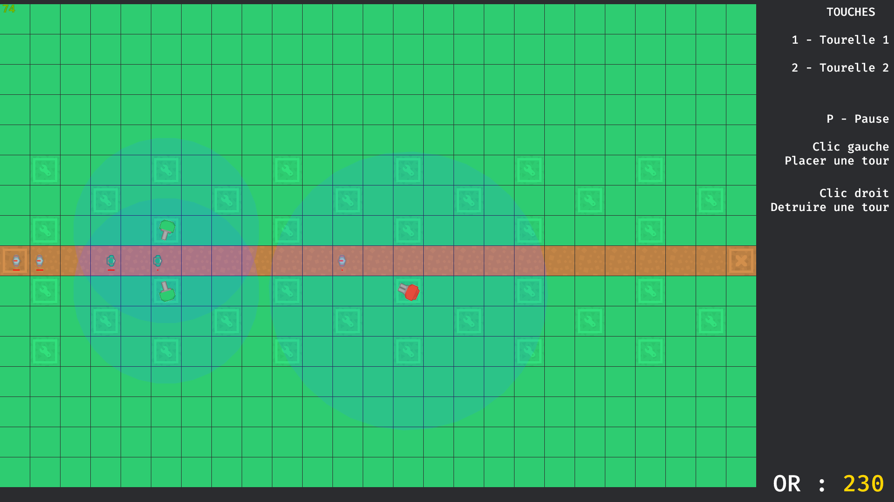

# Rust Tower Defence

Bienvenue sur notre démo technique d'un Tower Defense, fait en RUST avec le moteur de jeu Bevy (0.13).

Ceci est un petit jeu fait dans le cadre du cours pour apprendre Rust à l'ESIEA. 

## Setup

Une fois le projet cloné, vous aurez besoin d'avoir le compilateur Rust sur votre machine. 

Une fois cela fait, vous pouvez lancer le projet avec : 

` $ Cargo run`

Et attendre la petite demi-heure nécessaire à la première compilation :)

## Screenshots

## Ressources
[Tainted Coders](https://taintedcoders.com/)

[Unofficial cheatbook](https://bevy-cheatbook.github.io/)

[Tutoriel de Guillaume Gomez - Le top du top pour apprendre le rust](https://blog.guillaume-gomez.fr/Rust/1/1) 

[Tutoriel Bevy 0.10 youtube](https://www.youtube.com/watch?v=TQt-v_bFdao&list=PLVnntJRoP85JHGX7rGDu6LaF3fmDDbqyd)
